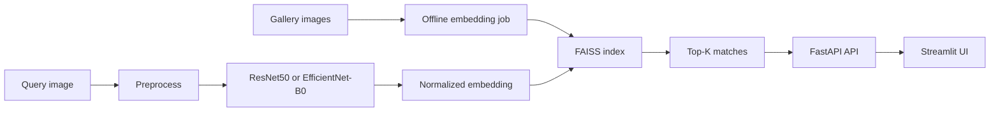

# Visual Similarity Search Engine

A full-stack visual retrieval system built around pretrained CNN embeddings and FAISS nearest-neighbor search.

## Architecture



## Features

- Pretrained ResNet50 or EfficientNet-B0 feature extraction
- Offline gallery embedding pipeline
- FAISS index build and search
- FastAPI backend with health, search, and image-serving endpoints
- Streamlit frontend for interactive retrieval
- Precision@K, Recall@K, and mAP evaluation utilities
- UMAP visualization for embedding-space inspection

## Setup

```powershell
python -m venv venv
.\venv\Scripts\Activate.ps1
pip install --upgrade pip
pip install -r requirements.txt
```

If `faiss-cpu` is unavailable on your Windows environment, install it with conda or use WSL2.

## Dataset

Put your images in `data/gallery/`.

Optional class subfolders make evaluation easier:

```text
data/gallery/
  cats/
  dogs/
  beaches/
```

## Build the index

```powershell
python -m pipeline.embed_gallery --image_dir data/gallery --output_dir data/embeddings --backbone resnet50 --batch_size 64
python scripts/build_index.py --embeddings_dir data/embeddings
```

## Run the backend

```powershell
uvicorn backend.main:app --reload --host 0.0.0.0 --port 8000
```

## Run the frontend

```powershell
streamlit run frontend/app.py
```

## Evaluation and visualization

```powershell
python -m evaluation.eval_metrics
python -m evaluation.visualize_embeddings
```

## API endpoints

- `GET /api/v1/health`
- `POST /api/v1/search`
- `GET /api/v1/image/{index_id}`

## Project layout

```text
visual-similarity-search/
├── backend/
├── data/
├── evaluation/
├── frontend/
├── models/
├── pipeline/
├── scripts/
└── requirements.txt
```
